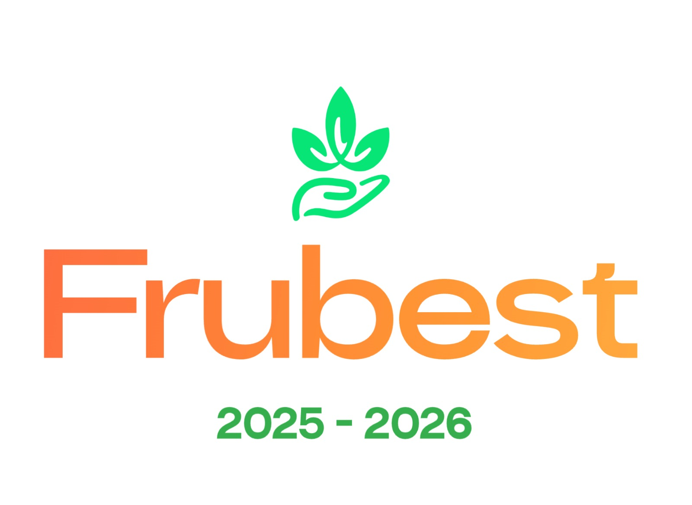

# Yurakuna - Sistema de Gestión de Hortalizas 🥬



Aplicación web para la gestión integral de productos agrícolas (hortalizas), desarrollada con Angular 21 y TypeScript.

## 📋 Descripción

Yurakuna es un sistema completo de gestión que permite:

- ✅ **Gestión de productos** - Control de inventario de hortalizas
- 👥 **Gestión de clientes** - Administración de la cartera de clientes
- 🚚 **Gestión de entregas** - Seguimiento de envíos y distribución
- 📦 **Control de stock** - Monitoreo en tiempo real del inventario
- 📉 **Control de merma** - Registro de productos dañados o caducados
- 🛒 **Gestión de pedidos** - Creación y seguimiento de órdenes
- 🔐 **Autenticación de usuarios** - Sistema seguro de login/registro
- 👤 **Gestión de roles** - Administrador, cliente y usuario
- 🔧 **Gestión de usuarios** - CRUD completo de usuarios del sistema

## 🚀 Stack Tecnológico

- **Framework**: Angular 21 (Standalone Components)
- **Lenguaje**: TypeScript 5.9
- **UI Library**: Angular Material 21
- **Estilos**: SCSS
- **State Management**: Angular Signals
- **Validación**: Zod
- **Utilidades de Fecha**: date-fns
- **Testing**: Vitest
- **API Backend**: Node.js (ver `API_DOC.md`)

## 📁 Estructura del Proyecto

```
yurakuna-front/
├── src/
│   ├── app/
│   │   ├── core/                    # Servicios singleton y configuración
│   │   │   ├── auth/                # Autenticación y autorización
│   │   │   │   ├── guards/          # Guards de rutas
│   │   │   │   ├── interceptors/    # HTTP interceptors
│   │   │   │   └── services/        # Servicios de auth
│   │   │   ├── models/              # Interfaces TypeScript
│   │   │   └── services/            # Servicios globales (API)
│   │   │
│   │   ├── features/                # Módulos de funcionalidades
│   │   │   ├── auth/                # Login y registro
│   │   │   ├── products/            # Gestión de productos
│   │   │   ├── clients/             # Gestión de clientes
│   │   │   ├── orders/              # Gestión de pedidos
│   │   │   ├── deliveries/          # Gestión de entregas
│   │   │   ├── stock/               # Control de stock
│   │   │   ├── shrinkage/           # Control de merma
│   │   │   └── users/               # Gestión de usuarios
│   │   │
│   │   ├── layout/                  # Layouts de la aplicación
│   │   │   ├── admin-layout/        # Layout para administrador
│   │   │   ├── client-layout/       # Layout para cliente
│   │   │   └── public-layout/       # Layout público
│   │   │
│   │   └── shared/                  # Componentes reutilizables
│   │       ├── components/
│   │       ├── directives/
│   │       ├── pipes/
│   │       └── utils/
│   │
│   ├── environments/                # Configuración de entornos
│   └── styles.scss                  # Estilos globales
│
├── public/                          # Archivos estáticos
├── API_DOC.md                       # Documentación de la API
└── package.json
```

## 🎨 Tema y Diseño

El proyecto utiliza Angular Material con una paleta de colores personalizada inspirada en el logo:

- **Primario**: Verde (#4caf50) - Representa frescura y naturaleza
- **Acento**: Naranja (#ff9800) - Energía y vitalidad
- **Warn**: Rojo - Alertas y errores

## 🛠️ Instalación y Configuración

### Prerrequisitos

- Node.js v18+ (se recomienda usar versiones LTS pares)
- npm 11.6.2+

### Instalación

```bash
# Clonar el repositorio
git clone <repo-url>
cd yurakuna-front

# Instalar dependencias
npm install
```

### Configuración de Entornos

Edita los archivos de entorno según tus necesidades:

- **Desarrollo**: `src/environments/environment.ts`
- **Producción**: `src/environments/environment.prod.ts`

```typescript
export const environment = {
  production: false,
  apiUrl: 'http://localhost:3000/api',  // URL de tu API
  apiTimeout: 30000,
  tokenRefreshEnabled: true,
};
```

## 🚀 Comandos Disponibles

```bash
# Iniciar servidor de desarrollo
npm start
# La aplicación estará disponible en http://localhost:4200

# Build de producción
npm run build:prod

# Ejecutar tests
npm test

# Build en modo watch
npm run watch

# Build y deploy manual a Cloudflare Workers
npm run deploy:workers
```

## ☁️ Deploy en Cloudflare Workers

El proyecto está configurado para desplegarse automáticamente a Cloudflare Workers en cada `push` a la rama `main` mediante GitHub Actions.

### Archivos de configuración

- `wrangler.toml`: define el Worker y publica los assets estáticos desde `dist/temp-yurakuna/browser`
- `.github/workflows/deploy-cloudflare-workers.yml`: ejecuta build de producción y despliegue

### Secrets requeridos en GitHub

Configura estos secretos en tu repositorio:

- `CLOUDFLARE_API_TOKEN`
- `CLOUDFLARE_ACCOUNT_ID`

El token debe tener permisos para desplegar Workers.

## 🔐 Autenticación

El sistema implementa autenticación JWT con refresh tokens:

- **Access Token**: Almacenado en localStorage, usado para autenticar requests
- **Refresh Token**: Usado para renovar access tokens expirados
- **Interceptor HTTP**: Maneja automáticamente el refresh de tokens en caso de 401

### Guards de Ruta

- **authGuard**: Protege rutas que requieren autenticación
- **roleGuard**: Protege rutas basadas en roles de usuario

## 📡 API

La aplicación se comunica con una API REST. Ver `API_DOC.md` para la documentación completa de endpoints.

**Base URL**: `http://localhost:3000/api`

### Endpoints Principales

- `/auth/*` - Autenticación
- `/products/*` - Productos
- `/clients/*` - Clientes
- `/orders/*` - Pedidos
- `/deliveries/*` - Entregas
- `/stock/*` - Stock y movimientos
- `/users/*` - Usuarios

## 🎯 Próximos Pasos

### Fase 2: Sistema de Autenticación
- Implementar componentes de login y registro
- Crear layouts base (admin, cliente, público)
- Configurar rutas protegidas

### Fase 3: Módulo de Productos
- Lista de productos con paginación y filtros
- Formulario de creación/edición de productos
- Servicio de productos

### Fase 4: Resto de Módulos
- Clientes
- Pedidos
- Entregas
- Stock y Merma
- Usuarios

## 📝 Licencia

Proyecto privado - Todos los derechos reservados

## 🤝 Contribución

Este es un proyecto privado. Para contribuir, contacta al administrador del proyecto.

---

Desarrollado con ❤️ para Yurakuna
